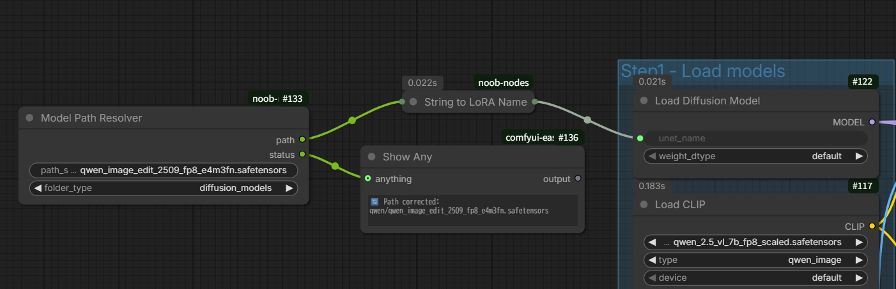

# Model Path Resolver

通常、モデルが正しくインストールされているにも関わらずworkflowに記載されたモデルパスと相対パスが違うだけでエラーが出ます

これを回避するため、**親ディレクトリ内を自動で検索し、同じ名前のモデルがあった場合それに置き換え**ます。

LoRAやControlNetなどmodelsフォルダ配下全てに対応していますのでので`folder_type`を正しく設定してください

各種Loaderには`String to LoRA Name`ノードを経由してつなぎます ※LoRA以外のどのノードにでも接続できます

同一モデルが複数あった場合は意図的にエラーで停止します

statusにはモデルパスがこれによって修正されたかどうかの状態が出力されます

# String To LoRA Name

stringで指定したloraファイルを、LoRA Loaderの"lora_name"ソケットに差すノードです

LoRAファイルなどをtomlなどの設定データから読み込むために使用します

※便宜上どんなソケットにも挿さる仕様なのでDiffusion Modelsなどリストから名称を選ぶタイプならあらゆるソケットで使用できます

# PathCleaner

ダブルクォーテーションで囲まれているパスからそれらを除去したパスを生成します

※Windows標準の「パスをコピー」を使用してスムーズにパスを貼り付けるためのノード

# Sequential Directory Generator

動画を連続して生成しpngなどの連番で保存する場合、どんどん同じフォルダにデータが書き出されてしまいます。

これを避けるために生成毎に自動で新しいフォルダを作成します。

アウトプットは作成されたディレクトリのパスを返すだけです。パスが入力できる保存ノードのピンに接続してご利用下さい。

# Square BBox From Mask

マスクを入力すると、そのマスクを正方形に整形したbboxのデータを出力します

実際にクロップする場合は Crop (mtb) などに接続してください

# Pixel Color Picker (HEX)

x,y座標を指定し、画像から特定の1pxのカラーをHEXコードで返します

RMBGのColor To Maskに接続する想定なためoutputはCOLORCODE型になっています

# update

## 26/03/24

Model Path Resolver 追加

## 26/02/03

Pixel Color Picker (HEX) 追加

## 260/1/28

String to LoRA Name追加

## 26/01/08

Square BBox From Mask追加
